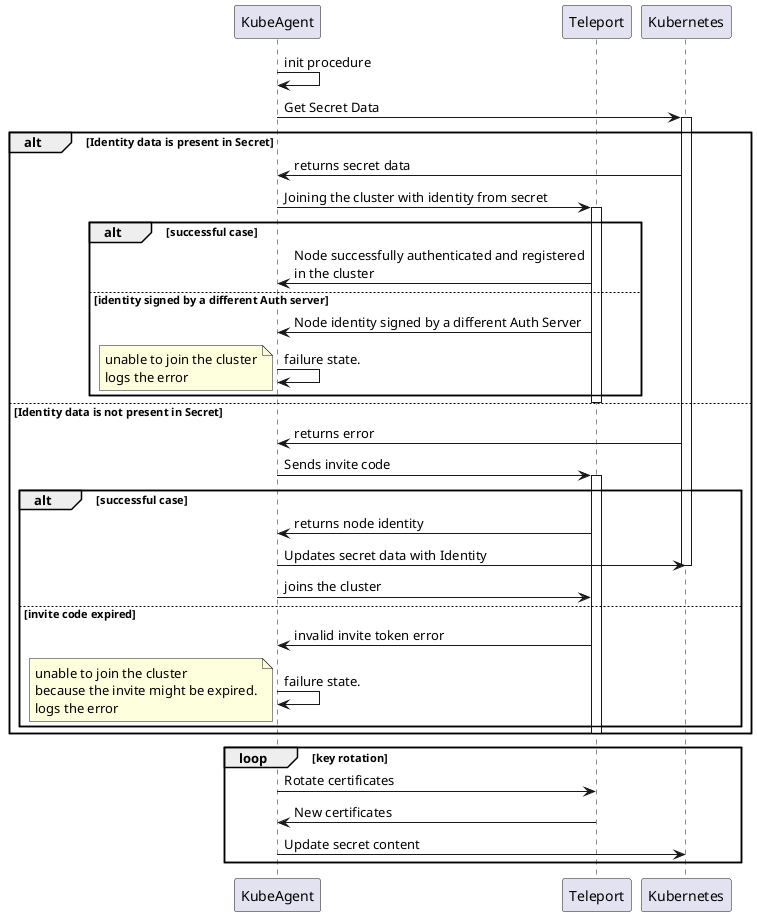

# RFD 73 - Teleport Kube-Agent credential storage in Kubernetes Native Secrets

## What

Teleport Kubernetes Agent support for dynamic short lived tokens relying only on native Kubernetes Secrets for indentity storage.

### Related issues

- [#5585](https://github.com/gravitational/teleport/issues/5585)

## Why

When Teleport Kube Agent wants to join a Teleport Cluster, it needs to share the invite token with the cluster for initial authentication. The invite token can be:

- short-lived token (the token will expire after a low TTL and cannot be reused after that time)
- long-lived static token (the usage of long-lived tokens is discouraging for security reasons).

After sharing the invite token with the Teleport cluster, the Kube agent receives its identity from the Auth service. Identity certificates are mandatory for accessing the Teleport Cluster and must be stored for accesses without reusing the invite token.

Kubernetes Pods are, by definition, expected to be stateless. This means that each time a Pod is recycled because it was restarted, deleted, upgraded, or moved to another node, the state that was written to the filesystem is lost.

One way to overcome this problem is to use Persistent Volumes. PV is a Kubernetes feature that mounts a storage volume in the container filesystem lifecycle is independent of the Pod that mounts it. Kubernetes’ PV storage has its own drawbacks. Persistent Volumes are very distinct between different cloud vendors. Some providers lock volumes to be mounted in the same zone they were created, meaning that if Teleport agent Pod is recycled, it must be maintained in the same zone it was created. This creates operational issues and for on-premises deployments might be difficult to manage.

Another possibility is that the Kube Agent might use the invite token each time the pod is recycled, meaning that it issues a join request to the cluster every time it starts and receives a new identity from the Auth service. This means that the invite token must be a static long-lived token, otherwise after a while the agent could not register himself in the cluster because the invite token expired and this might cause security flaws.

Allowing the Kube agent to use the secrets as storage backend will allow not only that the agent is able to run stateless depending only on native objects available in any Kubernetes cluster, but also that the agent might support dynamic short-lived invite tokens with no dependency on external storage.

## Details

### Secret creation and lifecycle

In order to use the secret storage, the secret must be created and handled by Kube Agent and not by  [Helm chart](https://github.com/gravitational/teleport/tree/master/examples/chart/teleport-kube-agent). This is required because if the secret is created by Helm but its content is managed by Kube Agent, once the user tries to upgrade the Kube Agent deployment, i.e. updating its version or configuration, the Helm will replace the content of the secret which results in failed authentication.

#### RBAC Changes

The Teleport Kube Agent service account must be able to create and edit secrets within the namespace that is running, therefore, one must create a new namespace role and attach it to the Kube Agent service account with the following content:
```yaml
- apiGroups: [""]
  # objects is "secrets"
  resources: ["secrets"]
  verbs: ["get", "create", "watch", "list"]
```

This allows the Kube Agent to read, create and list secrets using the credentials that Kubernetes mounts for each pod running in the cluster.

#### Secret content

Once Kube Agent creates the secret, it will hold the following information:

```yaml
apiVersion: v1
data: |
    {{.Values.kubeClusterName}}:
        {
        "kind": "identity",
        "version": "v2",
        "metadata": {
            "name": "current"
        },
        "spec": {
            "key": "{key_content}",
            "ssh_cert": "{ssh_cert_content}",
            "tls_cert": "{tls_cert_content}",
            "tls_ca_certs": ["tls_ca_certs"],
            "ssh_ca_certs": ["ssh_ca_certs"]
        }
        }

    
kind: Secret
metadata:
  name: {.Release.Name}-identity
  namespace: {.Release.Namespace}
```

Where:
- `ssh_cert` is a PEM encoded SSH host cert.
- `key` is a PEM encoded private key.
- `tls_cert` is a PEM encoded x509 client certificate.
- `tls_ca_certs` is a list of PEM encoded x509 certificate of the certificate authority of the cluster.
- `ssh_ca_certs` is a list of SSH certificate authorities encoded in the authorized_keys format.


### Teleport Changes

#### Kube Secret as storage backend

If secret storage is enabled, the Teleport Kube agent initializes with Kubernetes secret [backend storage](https://goteleport.com/docs/setup/reference/backends/). The backend storage availability for Teleport will be the following:

| Data type | Description | Supported storage backends |
|---|---|---|
| core cluster state | Cluster configuration (e.g. users, roles, auth connectors) and identity (e.g. certificate authorities, registered nodes, trusted clusters). | Local directory (SQLite), etcd, AWS DynamoDB, GCP Firestore, self-hosted PostgreSQL/CockroachDB (Preview) |
| audit events | JSON-encoded events from the audit log (e.g. user logins, RBAC changes) | Local directory, AWS DynamoDB, GCP Firestore |
| session recordings | Raw terminal recordings of interactive user sessions | Local directory, AWS S3 (and any S3-compatible product), GCP Cloud Storage |
| teleport instance state | ID and credentials of a non-auth teleport instance (e.g. node, proxy, kube) | Local directory, Kube Secret (only available for role=kube) |

The storage backend will be responsible for managing the Kubernetes secret, i.e. creating, reading and updating its contents, in order to create a transparent storage backend.

The configuration of the Kubernetes' Secret storage backend is done by adding the `storage` section to the teleport config.

```yaml
teleport:
...
  storage:
    # Type of backend: either "local" or "kubernetes_secret", by default "local"
    type: kubernetes_secret
...
```

If the identity secret exists in Kubernetes and has the node identity on it, the storage engine will parse and return the keys to the Agent so it can use them to authenticate in the Teleport Cluster. If the cluster access operation is successful, the agent will be available for usage, but if the access operation fails because the Teleport Auth does not validate the node credentials, the Agent will log an error providing insightful information about the failure cause.

If the identity secret does not exist or is empty, the Kube Agent will try to join the cluster with the invite token provided. If the invite token is valid (has details in the Teleport Cluster and did not expire yet), Teleport Cluster will reply with the agent identity. Given the identity, the Kube Agent will issue a write request to the storage backend that results in the update of the content in the secret `{{ .Release.Name }}-identity`. 

If the invite token is not valid or has expired, the Agent could not join the cluster and it will stop and log a meaningful error message.

The following scheme demonstrates the behaviour when using Kubernetes' Secret backend storage.

```
                                                              ┌─────────┐                                        ┌────────┐          ┌──────────┐                    
                                                              │KubeAgent│                                        │Teleport│          │Kubernetes│                    
                                                              └────┬────┘                                        └───┬────┘          └────┬─────┘                    
                                                                   ────┐                                             │                    │                          
                                                                       │ init procedure                              │                    │                          
                                                                   <───┘                                             │                    │                          
                                                                   │                                                 │                    │                          
                                                                   │                          Get Secret Data        │                   ┌┴┐                         
                                                                   │────────────────────────────────────────────────────────────────────>│ │                         
                                                                   │                                                 │                   │ │                         
                                                                   │                                                 │                   │ │                         
         ╔══════╤══════════════════════════════════════════════════╪═════════════════════════════════════════════════╪═══════════════════╪═╪════════════════════════╗
         ║ ALT  │  Identity data is present in Secret              │                                                 │                   │ │                        ║
         ╟──────┘                                                  │                                                 │                   │ │                        ║
         ║                                                         │                        returns secret data      │                   │ │                        ║
         ║                                                         │<─ ─ ─ ─ ─ ─ ─ ─ ─ ─ ─ ─ ─ ─ ─ ─ ─ ─ ─ ─ ─ ─ ─ ─ ─ ─ ─ ─ ─ ─ ─ ─ ─ ─ │ │                        ║
         ║                                                         │                                                 │                   │ │                        ║
         ║                                                         │ Joining the cluster with identity from secret  ┌┴┐                  │ │                        ║
         ║                                                         │───────────────────────────────────────────────>│ │                  │ │                        ║
         ║                                                         │                                                │ │                  │ │                        ║
         ║                                                         │                                                │ │                  │ │                        ║
         ║                   ╔══════╤══════════════════════════════╪════════════════════════════════════════════════╪═╪═════════════╗    │ │                        ║
         ║                   ║ ALT  │  successful case             │                                                │ │             ║    │ │                        ║
         ║                   ╟──────┘                              │                                                │ │             ║    │ │                        ║
         ║                   ║                                     │Node successfully authenticated and registered  │ │             ║    │ │                        ║
         ║                   ║                                     │in the cluster                                  │ │             ║    │ │                        ║
         ║                   ║                                     │<─ ─ ─ ─ ─ ─ ─ ─ ─ ─ ─ ─ ─ ─ ─ ─ ─ ─ ─ ─ ─ ─ ─ ─│ │             ║    │ │                        ║
         ║                   ╠═════════════════════════════════════╪════════════════════════════════════════════════╪═╪═════════════╣    │ │                        ║
         ║                   ║ [identity signed by a different Auth server]                                         │ │             ║    │ │                        ║
         ║                   ║                                     │Node identity signed by a different Auth Server │ │             ║    │ │                        ║
         ║                   ║                                     │<─ ─ ─ ─ ─ ─ ─ ─ ─ ─ ─ ─ ─ ─ ─ ─ ─ ─ ─ ─ ─ ─ ─ ─│ │             ║    │ │                        ║
         ║                   ║                                     │                                                │ │             ║    │ │                        ║
         ║                   ║      ╔════════════════════════════╗ ────┐                                            │ │             ║    │ │                        ║
         ║                   ║      ║unable to join the cluster ░║     │ failure state.                             │ │             ║    │ │                        ║
         ║                   ║      ║logs the error              ║ <───┘                                            │ │             ║    │ │                        ║
         ║                   ╚══════╚════════════════════════════╝═╪════════════════════════════════════════════════╪═╪═════════════╝    │ │                        ║
         ╠═════════════════════════════════════════════════════════╪═════════════════════════════════════════════════════════════════════╪═╪════════════════════════╣
         ║ [Identity data is not present in Secret]                │                                                 │                   │ │                        ║
         ║                                                         │                           returns error         │                   │ │                        ║
         ║                                                         │<─ ─ ─ ─ ─ ─ ─ ─ ─ ─ ─ ─ ─ ─ ─ ─ ─ ─ ─ ─ ─ ─ ─ ─ ─ ─ ─ ─ ─ ─ ─ ─ ─ ─ │ │                        ║
         ║                                                         │                                                 │                   │ │                        ║
         ║                                                         │               Sends invite code                ┌┴┐                  │ │                        ║
         ║                                                         │───────────────────────────────────────────────>│ │                  │ │                        ║
         ║                                                         │                                                │ │                  │ │                        ║
         ║                                                         │                                                │ │                  │ │                        ║
         ║         ╔══════╤════════════════════════════════════════╪════════════════════════════════════════════════╪═╪══════════════════╪═╪══════════════╗         ║
         ║         ║ ALT  │  successful case                       │                                                │ │                  │ │              ║         ║
         ║         ╟──────┘                                        │                                                │ │                  │ │              ║         ║
         ║         ║                                               │             returns node identity              │ │                  │ │              ║         ║
         ║         ║                                               │<─ ─ ─ ─ ─ ─ ─ ─ ─ ─ ─ ─ ─ ─ ─ ─ ─ ─ ─ ─ ─ ─ ─ ─│ │                  │ │              ║         ║
         ║         ║                                               │                                                │ │                  └┬┘              ║         ║
         ║         ║                                               │                  Updates secret data with Identity                   │               ║         ║
         ║         ║                                               │─────────────────────────────────────────────────────────────────────>│               ║         ║
         ║         ║                                               │                                                │ │                   │               ║         ║
         ║         ║                                               │               joins the cluster                │ │                   │               ║         ║
         ║         ║                                               │───────────────────────────────────────────────>│ │                   │               ║         ║
         ║         ╠═══════════════════════════════════════════════╪════════════════════════════════════════════════╪═╪═══════════════════╪═══════════════╣         ║
         ║         ║ [invite code expired]                         │                                                │ │                   │               ║         ║
         ║         ║                                               │          invalid invite token error            │ │                   │               ║         ║
         ║         ║                                               │<─ ─ ─ ─ ─ ─ ─ ─ ─ ─ ─ ─ ─ ─ ─ ─ ─ ─ ─ ─ ─ ─ ─ ─│ │                   │               ║         ║
         ║         ║                                               │                                                │ │                   │               ║         ║
         ║         ║      ╔══════════════════════════════════════╗ ────┐                                            │ │                   │               ║         ║
         ║         ║      ║unable to join the cluster           ░║     │ failure state.                             │ │                   │               ║         ║
         ║         ║      ║because the invite might be expired.  ║ <───┘                                            │ │                   │               ║         ║
         ║         ║      ║logs the error                        ║ │                                                │ │                   │               ║         ║
         ║         ╚══════╚══════════════════════════════════════╝═╪════════════════════════════════════════════════╪═╪═══════════════════╪═══════════════╝         ║
         ╚═════════════════════════════════════════════════════════╪══════════════════════════════════════════════════════════════════════╪═════════════════════════╝
                                                                   │                                                 │                    │                          
                                                                   │                                                 │                    │                          
                                                    ╔═══════╤══════╪═════════════════════════════════════════════════╪════════════════════╪═══════════════╗          
                                                    ║ LOOP  │  key rotation                                          │                    │               ║          
                                                    ╟───────┘      │                                                 │                    │               ║          
                                                    ║              │              Rotate certificates                │                    │               ║          
                                                    ║              │────────────────────────────────────────────────>│                    │               ║          
                                                    ║              │                                                 │                    │               ║          
                                                    ║              │                New certificates                 │                    │               ║          
                                                    ║              │<─ ─ ─ ─ ─ ─ ─ ─ ─ ─ ─ ─ ─ ─ ─ ─ ─ ─ ─ ─ ─ ─ ─ ─ │                    │               ║          
                                                    ║              │                                                 │                    │               ║          
                                                    ║              │                     Update certificate content  │                    │               ║          
                                                    ║              │─────────────────────────────────────────────────────────────────────>│               ║          
                                                    ╚══════════════╪═════════════════════════════════════════════════╪════════════════════╪═══════════════╝          
                                                              ┌────┴────┐                                        ┌───┴────┐          ┌────┴─────┐                    
                                                              │KubeAgent│                                        │Teleport│          │Kubernetes│                    
                                                              └─────────┘                                        └────────┘          └──────────┘                    
```

### Backend storage

Kubernetes Secret backend storage must satisfy the `Backend` interface.

```go
// Backend implements abstraction over local or remote storage backend.
// Item keys are assumed to be valid UTF8, which may be enforced by the
// various Backend implementations.
type Backend interface {
	// Create creates item if it does not exist
	Create(ctx context.Context, i Item) (*Lease, error)

	// Put puts value into backend (creates if it does not
	// exists, updates it otherwise)
	Put(ctx context.Context, i Item) (*Lease, error)

	// CompareAndSwap compares item with existing item
	// and replaces is with replaceWith item
	CompareAndSwap(ctx context.Context, expected Item, replaceWith Item) (*Lease, error)

	// Update updates value in the backend
	Update(ctx context.Context, i Item) (*Lease, error)

	// Get returns a single item or not found error
	Get(ctx context.Context, key []byte) (*Item, error)

	// GetRange returns query range
	GetRange(ctx context.Context, startKey []byte, endKey []byte, limit int) (*GetResult, error)

	// Delete deletes item by key, returns NotFound error
	// if item does not exist
	Delete(ctx context.Context, key []byte) error

	// DeleteRange deletes range of items with keys between startKey and endKey
	DeleteRange(ctx context.Context, startKey, endKey []byte) error

	// KeepAlive keeps object from expiring, updates lease on the existing object,
	// expires contains the new expiry to set on the lease,
	// some backends may ignore expires based on the implementation
	// in case if the lease managed server side
	KeepAlive(ctx context.Context, lease Lease, expires time.Time) error

	// NewWatcher returns a new event watcher
	NewWatcher(ctx context.Context, watch Watch) (Watcher, error)

	// Close closes backend and all associated resources
	Close() error

	// Clock returns clock used by this backend
	Clock() clockwork.Clock

	// CloseWatchers closes all the watchers
	// without closing the backend
	CloseWatchers()
}
```

During the startup procedure, the bakcend instantiates a Kubernetes client with configuration provided by `restclient.InClusterConfig()`. This configuration uses the credentials setup for the service account configured for the pod.

For each method defined in the backend interface, one must use the Kubernetes client in order to operate the secret.

The storage must, for now, skip the writting requests for events of type  `kind=state` and each time a identity write request is issued it must replace the content of the secret with the provided content. 
Storage engine might use resource lock feature from Kubernetes ( `resourceVersion`) to prevent multiple writes to the same file from different agents.


### Helm Chart Differences

File **templates/config.yaml**:
```diff 
{{- $logLevel := (coalesce .Values.logLevel .Values.log.level "INFO") -}}
{{- if .Values.teleportVersionOverride -}}
  {{- $_ := set . "teleportVersion" .Values.teleportVersionOverride -}}
{{- else -}}
  {{- $_ := set . "teleportVersion" .Chart.Version -}}
{{- end -}}
apiVersion: v1
kind: ConfigMap
metadata:
  name: {{ .Release.Name }}
  namespace: {{ .Release.Namespace }}
{{- if .Values.extraLabels.config }}
  labels:
  {{- toYaml .Values.extraLabels.config | nindent 4 }}
{{- end }}
  {{- if .Values.annotations.config }}
  annotations:
    {{- toYaml .Values.annotations.config | nindent 4 }}
  {{- end }}
data:
  teleport.yaml: |
    teleport:
+{{- if not (.Values.enabled) }}
+     storage:
+       type: kubernetes_secret
+       secret_name: {{ .Release.Name }}-identity
+{{- end }}
      auth_token: "/etc/teleport-secrets/auth-token"
      auth_servers: ["{{ required "proxyAddr is required in chart values" .Values.proxyAddr }}"]
```

File `values.yaml`:
```diff
storage:
  enabled: false
  storageClassName: ""
  requests: 128Mi
```

### Limitations

High availability is only achieved using Statefulsets because it is required that some Kubernetes invariant is kept between restarts. This is mandatory because mapping between the agent replica number and the agent identity must be done, and this is achieved with Statefulset pod names.

With this, it is required to expose the `$POD_NAME` environment variable to each pod and it will be used to store the identity information in a separate secret for each replica running.

Given this setup, the secret name will be changed to `{{ .Release.Name }}-identity-$POD_NAME` and will store a single replica identity.

## Instalation
If the user does not provide `storage.enabled=true`, Teleport Kube Agent chart enables, by default, the Kube secret storage. This means that there is no change to the end user.

```
$ helm install teleport-kube-agent . \
  --create-namespace \
  --namespace teleport \
  --set roles=kube \
  --set proxyAddr=${PROXY_ENDPOINT?} \
  --set authToken=${JOIN_TOKEN?} \
  --set kubeClusterName=${KUBERNETES_CLUSTER_NAME?}
```


<!-- Plant UML diagrams -->
<!--


-->